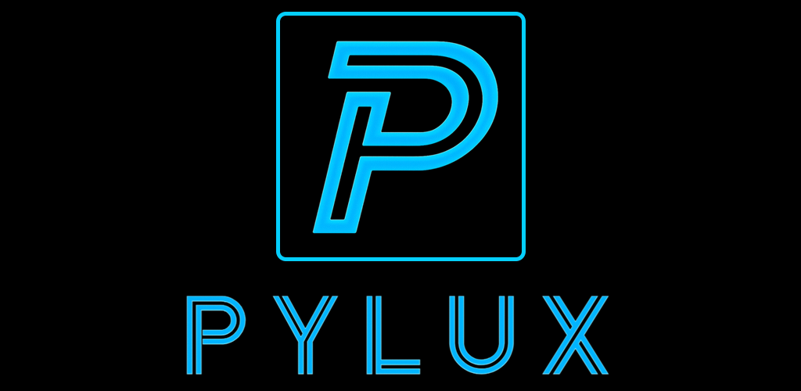

# Pylux

A Chiaki fork focused on providing exceptional Android support with internet streaming functionality. Stream your favorite games anywhere with remote play integration.

## Features
- Full Android support with modern UI
- Remote play over the internet
- Local network remote play
- Cloud gaming support
- Automatic console discovery and registration

## Legal Disclaimer
This project is not endorsed or certified by Sony Interactive Entertainment LLC. All trademarks are the property of their respective owners.

## Credits
Special thanks to the original Chiaki development team for their excellent work on the foundation of this project. This fork builds upon their incredible efforts to bring remote play to open source platforms.